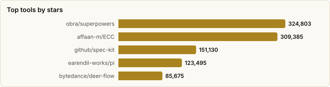

# Agent Harnesses — Six Approaches to Running Autonomous Agents

> Derived from **kaiser-data**'s 2,896 starred repos (snapshot `2026-11-16T14:38:50.632Z`), cross-referenced with the repo-similarity graph (2,896 nodes / 9,609 edges, 48 communities).
>
> Generated 2026-11-16 by `scripts/reports/agent_harnesses.py` (regenerate any time — no API cost).

## Executive summary

- A **harness** is everything around the model: the loop, tools, state, guardrails, and execution environment. **41 harness projects** in your stars (**1,745,959★** combined) cluster into **six distinct approaches** — they disagree about *where the harness lives* and *what the hard problem is*:
  - **Harness-as-SDK** (11): `pi`, `openhuman`, `deepagents`, `jcode`, `parlant`, `harness-sdk`, `eve`, `cheetahclaws`, `dexto`, `yoagent`, `tinyagents`
  - **Meta-harness over coding agents** (7): `superpowers`, `ECC`, `ruflo`, `oh-my-openagent`, `oh-my-claudecode`, `Archon`, `munder-difflin`
  - **Fleet / parallel orchestration** (7): `multica`, `vibe-kanban`, `gastown`, `agent-orchestrator`, `Aperant`, `ccpm`, `container-use`
  - **Determinism & spec-driven** (5): `spec-kit`, `OpenSpec`, `planning-with-files`, `agents.md`, `loop-engineering`
  - **Sandbox substrate** (6): `cua`, `NemoClaw`, `OpenShell`, `OpenSandbox`, `runtime`, `shell`
  - **Autonomous long-horizon** (5): `deer-flow`, `agent-zero`, `sia`, `agent`, `ClaudeNightsWatch`
- The fault line: **build the loop** (Harness-as-SDK) vs **wrap an existing agent** (meta-harness) vs **multiply agents** (fleet) — with determinism, sandboxing, and long-horizon autonomy as orthogonal bets any of them can adopt.
- Star mass sits with the meta-harnesses (`superpowers`, `ECC`, `ruflo`) — the ecosystem is betting that the inner loop is a solved commodity and the value is in the layer above it.

## The six approaches, compared

| Approach | Core bet | When it wins |
|---|---|---|
| **Harness-as-SDK** | You own the loop in code — tools, state, and control flow are a library you compose. | Building a *product* around an agent; you need custom behavior and testability. |
| **Meta-harness over coding agents** | Claude Code/Codex already won the inner loop — add skills, memory, and orchestration *around* it. | Developer workflows; you want leverage today without rebuilding tool-use. |
| **Fleet / parallel orchestration** | Throughput beats IQ — run many agents in worktrees/sandboxes and manage them like a team. | Large backlogs of separable tasks; PR-shaped work. |
| **Determinism & spec-driven** | Repeatability beats improvisation — specs, plans-on-disk, and standards steer the loop. | Teams that need auditable, resumable, low-variance agent output. |
| **Sandbox substrate** | The hard problem is *where* agents run — isolation, speed, and forking are the product. | Untrusted/generated code, computer-use, or massively parallel execution. |
| **Autonomous long-horizon** | Maximize wall-clock autonomy — agents that plan, persist, and keep going for hours or days. | Research, background maintenance, overnight queues; outcome > oversight. |

## Master comparison

Sorted by stars. `Health`/`Lifecycle` are the dataset's computed metrics; `Activity` is derived from days-since-push + 90-day commits.

| Tool | Approach | Lang | License | ★ Stars | Lifecycle | Health | Activity | Last push | Age | Contrib(90d) |
|---|---|---|---|---|---|---|---|---|---|---|
| [obra/superpowers](https://github.com/obra/superpowers) | Meta-harness over coding agents | Shell | MIT | 318,369 (▲3,481) | Mature | 63 | active | 13d ago | 1.1y | 1 |
| [affaan-m/ECC](https://github.com/affaan-m/ECC) | Meta-harness over coding agents | JavaScript | MIT | 304,244 (▲4,264) | Hot | 79 | very active | 0d ago | 10mo | 4 |
| [github/spec-kit](https://github.com/github/spec-kit) | Determinism & spec-driven | Python | MIT | 150,046 (▲1,131) | Hot | 84 | very active | 0d ago | 1.2y | 24 |
| [earendil-works/pi](https://github.com/earendil-works/pi) | Harness-as-SDK | TypeScript | MIT | 122,314 (▲1,295) | Hot | 80 | very active | 0d ago | 1.3y | 5 |
| [bytedance/deer-flow](https://github.com/bytedance/deer-flow) | Autonomous long-horizon | Python | MIT | 85,395 (▲212) | Hot | 89 | very active | 0d ago | 1.5y | 51 |
| [ruvnet/ruflo](https://github.com/ruvnet/ruflo) | Meta-harness over coding agents | TypeScript | MIT | 81,856 (▲530) | Hot | 84 | very active | 0d ago | 1.5y | 10 |
| [Fission-AI/OpenSpec](https://github.com/Fission-AI/OpenSpec) | Determinism & spec-driven | TypeScript | MIT | 74,968 (▲576) | Hot | 83 | very active | 0d ago | 1.3y | 25 |
| [code-yeongyu/oh-my-openagent](https://github.com/code-yeongyu/oh-my-openagent) | Meta-harness over coding agents | TypeScript | NOASSERTION | 70,942 (▲144) | Rising | 77 | very active | 0d ago | 11mo | 1 |
| [multica-ai/multica](https://github.com/multica-ai/multica) | Fleet / parallel orchestration | Go | NOASSERTION | 56,330 (▲926) | Hot | 77 | very active | 0d ago | 10mo | 12 |
| [tinyhumansai/openhuman](https://github.com/tinyhumansai/openhuman) | Harness-as-SDK | Rust | GPL-3.0 | 42,714 (▲107) | Rising | 79 | very active | 0d ago | 9mo | 1 |
| [Yeachan-Heo/oh-my-claudecode](https://github.com/Yeachan-Heo/oh-my-claudecode) | Meta-harness over coding agents | TypeScript | MIT | 40,860 (▲150) | Hot | 80 | very active | 1d ago | 10mo | 10 |
| [trycua/cua](https://github.com/trycua/cua) | Sandbox substrate | Rust | MIT | 32,442 (▲377) | Hot | 75 | very active | 0d ago | 1.8y | 6 |
| [langchain-ai/deepagents](https://github.com/langchain-ai/deepagents) | Harness-as-SDK | Python | MIT | 31,326 (▲189) | Hot | 94 | very active | 0d ago | 1.3y | 20 |
| [BloopAI/vibe-kanban](https://github.com/BloopAI/vibe-kanban) | Fleet / parallel orchestration | Rust | Apache-2.0 | 28,707 (▲80) | Mature | 67 | very active | 1d ago | 1.4y | 6 |
| [OthmanAdi/planning-with-files](https://github.com/OthmanAdi/planning-with-files) | Determinism & spec-driven | Shell | MIT | 28,091 (▲125) | Hot | 79 | very active | 5d ago | 10mo | 15 |
| [agentsmd/agents.md](https://github.com/agentsmd/agents.md) | Determinism & spec-driven | TypeScript | MIT | 25,516 (▲107) | Declining | 35 | slowing | 2mo ago | 1.2y | 2 |
| [coleam00/Archon](https://github.com/coleam00/Archon) | Meta-harness over coding agents | TypeScript | MIT | 23,928 (▲61) | Hot | 79 | very active | 0d ago | 1.8y | 7 |
| [NVIDIA/NemoClaw](https://github.com/NVIDIA/NemoClaw) | Sandbox substrate | TypeScript | Apache-2.0 | 23,036 (▲42) | Hot | 71 | very active | 0d ago | 8mo | 19 |
| [1jehuang/jcode](https://github.com/1jehuang/jcode) | Harness-as-SDK | Rust | MIT | 21,811 (▲174) | Rising | 76 | very active | 0d ago | 10mo | 2 |
| [NVIDIA/OpenShell](https://github.com/NVIDIA/OpenShell) | Sandbox substrate | Rust | Apache-2.0 | 21,674 (▲367) | Hot | 98 | very active | 0d ago | 8mo | 27 |
| [agent0ai/agent-zero](https://github.com/agent0ai/agent-zero) | Autonomous long-horizon | Python | NOASSERTION | 19,879 (▲69) | Mature | 79 | very active | 0d ago | 2.4y | 3 |
| [gastownhall/gastown](https://github.com/gastownhall/gastown) | Fleet / parallel orchestration | Go | MIT | 18,810 (▲66) | Rising | 65 | active | 2d ago | 11mo | 1 |
| [emcie-co/parlant](https://github.com/emcie-co/parlant) | Harness-as-SDK | Python | Apache-2.0 | 18,334 (▲6) | Mature | 79 | very active | 0d ago | 2.8y | 2 |
| [opensandbox-group/OpenSandbox](https://github.com/opensandbox-group/OpenSandbox) | Sandbox substrate | Go | Apache-2.0 | 17,347 (▲578) | Hot | 78 | very active | 0d ago | 11mo | 10 |
| [OrchestratorInc/agent-orchestrator](https://github.com/OrchestratorInc/agent-orchestrator) | Fleet / parallel orchestration | TypeScript | Apache-2.0 | 14,804 (▲472) | Hot | 88 | very active | 0d ago | 9mo | 22 |
| [AndyMik90/Aperant](https://github.com/AndyMik90/Aperant) | Fleet / parallel orchestration | TypeScript | AGPL-3.0 | 14,617 (▲21) | Declining | 42 | slowing | 5mo ago | 11mo | 0 |
| [cobusgreyling/loop-engineering](https://github.com/cobusgreyling/loop-engineering) | Determinism & spec-driven | TypeScript | MIT | 11,786 (▲50) | Hot | 68 | very active | 0d ago | 5mo | 11 |
| [HarnessMD/munder-difflin](https://github.com/HarnessMD/munder-difflin) | Meta-harness over coding agents | JavaScript | MIT | 9,580 (▲136) | Rising | 74 | very active | 0d ago | 5mo | 1 |
| [strands-agents/harness-sdk](https://github.com/strands-agents/harness-sdk) | Harness-as-SDK | TypeScript | Apache-2.0 | 9,224 (▲138) | Hot | 87 | very active | 0d ago | 1.5y | 26 |
| [automazeio/ccpm](https://github.com/automazeio/ccpm) | Fleet / parallel orchestration | Shell | MIT | 8,452 (▲15) | Mature | 49 | active | 12d ago | 1.2y | 1 |
| [vercel/eve](https://github.com/vercel/eve) | Harness-as-SDK | TypeScript | Apache-2.0 | 5,918 (▲88) | Hot | 82 | very active | 0d ago | 5mo | 11 |
| [dagger/container-use](https://github.com/dagger/container-use) | Fleet / parallel orchestration | Go | Apache-2.0 | 4,093 (▲6) | Declining | 35 | active | 2d ago | 1.5y | 0 |
| [hexo-ai/sia](https://github.com/hexo-ai/sia) | Autonomous long-horizon | Python | MIT | 2,169 (▼1) | Mature | 42 | slowing | 2mo ago | 7mo | 5 |
| [stakpak/agent](https://github.com/stakpak/agent) | Autonomous long-horizon | Rust | Apache-2.0 | 1,881 (▲20) | Declining | 39 | slowing | 4mo ago | 1.9y | 0 |
| [e2b-dev/runtime](https://github.com/e2b-dev/runtime) | Sandbox substrate | Go | Apache-2.0 | 1,850 (▲27) | Classic | 88 | very active | 0d ago | 3.3y | 16 |
| [SAIL-Research-Lab/cheetahclaws](https://github.com/SAIL-Research-Lab/cheetahclaws) | Harness-as-SDK | Python | Apache-2.0 | 802 (▲5) | Hot | 71 | very active | 0d ago | 7mo | 5 |
| [truffle-ai/dexto](https://github.com/truffle-ai/dexto) | Harness-as-SDK | TypeScript | NOASSERTION | 661 (▲2) | Hot | 78 | very active | 0d ago | 1.6y | 3 |
| [yologdev/yoagent](https://github.com/yologdev/yoagent) | Harness-as-SDK | Rust | MIT | 377 (▲8) | Hot | 79 | very active | 1d ago | 9mo | 3 |
| [aniketkarne/ClaudeNightsWatch](https://github.com/aniketkarne/ClaudeNightsWatch) | Autonomous long-horizon | Shell | MIT | 370 (▲1) | Declining | 43 | active | 1mo ago | 1.3y | 1 |
| [strands-agents/shell](https://github.com/strands-agents/shell) | Sandbox substrate | Rust | Apache-2.0 | 301 (▲15) | Hot | 73 | very active | 0d ago | 8mo | 6 |
| [tinyhumansai/tinyagents](https://github.com/tinyhumansai/tinyagents) | Harness-as-SDK | Rust | GPL-3.0 | 135 (▲4) | Hot | 80 | very active | 2d ago | 4mo | 4 |

## By approach

### Harness-as-SDK

_The loop as a library: you import the harness, register tools, and own control flow. Maximum flexibility, maximum responsibility — you maintain planning, retries, memory, and safety yourself._

- **[earendil-works/pi](https://github.com/earendil-works/pi)** · 122,314★ · TypeScript · Hot  
  Unified LLM API + agent loop + TUI + coding-agent CLI in one toolkit — the loop as a library.  
  topics: —
- **[tinyhumansai/openhuman](https://github.com/tinyhumansai/openhuman)** · 42,714★ · Rust · Rising  
  Lean open-source harness built for density — claims 500+ agents on a $10 VPS; the cost-floor end of the field.  
  topics: ai-agents, llm, local-first, rust, agent-orchestration, ai-assistant, desktop, mcp
- **[langchain-ai/deepagents](https://github.com/langchain-ai/deepagents)** · 31,326★ · Python · Hot  
  The 'batteries-included agent harness' — planning, sub-agents, filesystem, from the LangChain team.  
  topics: deepagents, langchain, langgraph, ai, python, typescript, harness, harness-engineering
- **[1jehuang/jcode](https://github.com/1jehuang/jcode)** · 21,811★ · Rust · Rising  
  Rust-built coding-agent harness — CLI agent loop with MCP support and multi-model wiring.  
  topics: ai, claude, cli, coding-agent, llm, mcp, openai, rust
- **[emcie-co/parlant](https://github.com/emcie-co/parlant)** · 18,334★ · Python · Mature  
  Interaction *control* harness — behavioral guidelines enforced at runtime for customer-facing agents.  
  topics: llm, customer-service, customer-success, python, ai-agent, customer-experience, lead-generation
- **[strands-agents/harness-sdk](https://github.com/strands-agents/harness-sdk)** · 9,224★ · TypeScript · Hot  
  AWS's open SDK to build an agent harness and control it end-to-end in production.  
  topics: agentic, agentic-ai, agents, ai, autonomous-agents, llm, multi-agent-systems, python
- **[vercel/eve](https://github.com/vercel/eve)** · 5,918★ · TypeScript · Hot  
  Vercel's framework for building agents — harness + sandbox as one integrated runtime.  
  topics: agent, framework, harness, javascript, markdown, typescript, vercel, sandbox
- **[SAIL-Research-Lab/cheetahclaws](https://github.com/SAIL-Research-Lab/cheetahclaws)** · 802★ · Python · Hot  
  Fast, easy agent-harness infrastructure aimed at long-horizon, multi-model runs.  
  topics: agentic-ai, claude, claude-code, memory, python, skills, openclaw
- **[truffle-ai/dexto](https://github.com/truffle-ai/dexto)** · 661★ · TypeScript · Hot  
  Harness and toolkit for building agent apps — CLI plus SDKs, configured rather than coded.  
  topics: llm, mcp, typescript, ai-agents, ai-tools, modelcontextprotocol, ai, mcp-client
- **[yologdev/yoagent](https://github.com/yologdev/yoagent)** · 377★ · Rust · Hot  
  The agent loop as a Rust crate — streams from seven LLM protocols, runs tools, loops until done.  
  topics: agent, agent-framework, ai, ai-agents, anthropic, claude, coding-agent, gemini
- **[tinyhumansai/tinyagents](https://github.com/tinyhumansai/tinyagents)** · 135★ · Rust · Hot  
  Small, provider-neutral harness in Rust — a readable minimal loop from the openhuman team.  
  topics: agent-framework, ai-agents, llm, rust, artificial-intelligence, automation, developer-tools, multi-agent

### Meta-harness over coding agents

_These projects treat Claude Code / Codex as the engine and build the transmission: skills, personas, memory, token discipline, and multi-agent coordination injected via configs, hooks, and subagents._

- **[obra/superpowers](https://github.com/obra/superpowers)** · 318,369★ · Shell · Mature  
  Skills framework + development methodology layered onto the agent you already run.  
  topics: ai, brainstorming, coding, obra, sdlc, skills, superpowers, subagent-driven-development
- **[affaan-m/ECC](https://github.com/affaan-m/ECC)** · 304,244★ · JavaScript · Hot  
  Harness performance optimization: skills, instincts, memory, security, hooks on top of Claude Code.  
  topics: ai-agents, anthropic, claude, claude-code, developer-tools, llm, mcp, productivity
- **[ruvnet/ruflo](https://github.com/ruvnet/ruflo)** · 81,856★ · TypeScript · Hot  
  The leading agent *meta*-harness — swarms, coordination, and autonomy on top of existing agents.  
  topics: agent-memory, agent-orchestration, agentic-ai, agentic-workflow, ai-agents, autonomous-agents, claude, claude-code
- **[code-yeongyu/oh-my-openagent](https://github.com/code-yeongyu/oh-my-openagent)** · 70,942★ · TypeScript · Rising  
  'The one and only agent harness for complex coding' — tokenmaxxer harness wrapping coding agents.  
  topics: opencode, ai, anthropic, claude, claude-skills, cursor, gemini, ide
- **[Yeachan-Heo/oh-my-claudecode](https://github.com/Yeachan-Heo/oh-my-claudecode)** · 40,860★ · TypeScript · Hot  
  Teams-first multi-agent orchestration living entirely inside Claude Code.  
  topics: agentic-coding, ai-agents, claude, claude-code, oh-my-opencode, opencode, vibe-coding, automation
- **[coleam00/Archon](https://github.com/coleam00/Archon)** · 23,928★ · TypeScript · Hot  
  'Harness builder' — make AI coding deterministic and repeatable by generating the harness itself.  
  topics: ai, automation, bun, claude, cli, coding-assistant, developer-tools, typescript
- **[HarnessMD/munder-difflin](https://github.com/HarnessMD/munder-difflin)** · 9,580★ · JavaScript · Rising  
  Runs an 'office' of Claude Code / Codex agents with roles — an open alternative to hosted agent-team products.  
  topics: agents, claude-code, harness, harness-engineering, memory, agent-orchestration, ai-agents, autonomous-agents

### Fleet / parallel orchestration

_One agent is a tool; a fleet is a team. The harness problem becomes scheduling, isolation (worktrees, containers), review queues, and merge discipline._

- **[multica-ai/multica](https://github.com/multica-ai/multica)** · 56,330★ · Go · Hot  
  Managed-agents platform: assign tasks to coding agents like teammates and supervise them.  
  topics: —
- **[BloopAI/vibe-kanban](https://github.com/BloopAI/vibe-kanban)** · 28,707★ · Rust · Mature  
  A kanban board as the harness — queue, run, and review many agent tasks in parallel.  
  topics: agent, ai-agents, kanban, management, task-manager
- **[gastownhall/gastown](https://github.com/gastownhall/gastown)** · 18,810★ · Go · Rising  
  Multi-agent workspace manager — the 'town' where a fleet of agents live and work.  
  topics: —
- **[OrchestratorInc/agent-orchestrator](https://github.com/OrchestratorInc/agent-orchestrator)** · 14,804★ · TypeScript · Hot  
  Plans tasks, spawns parallel coding agents in worktrees, merges autonomously.  
  topics: claude-code, codex-cli, orchestration, orchestrator, skills, agent-fleet, agent-swarm, git-worktrees
- **[AndyMik90/Aperant](https://github.com/AndyMik90/Aperant)** · 14,617★ · TypeScript · Declining  
  Autonomous multi-session AI coding — sessions as the unit of parallelism.  
  topics: —
- **[automazeio/ccpm](https://github.com/automazeio/ccpm)** · 8,452★ · Shell · Mature  
  GitHub Issues + git worktrees as the coordination fabric for parallel agents.  
  topics: ai-agents, ai-coding, claude, claude-code, project-management, vibe-coding
- **[dagger/container-use](https://github.com/dagger/container-use)** · 4,093★ · Go · Declining  
  Containerized dev environments so multiple agents work safely and independently.  
  topics: —

### Determinism & spec-driven

_The counter-culture: agents drift, so pin them down. Specs, standards files, and plans persisted to disk make runs reproducible, auditable, and resumable after crashes._

- **[github/spec-kit](https://github.com/github/spec-kit)** · 150,046★ · Python · Hot  
  Spec-Driven Development toolkit — the spec, not the prompt, steers the agent.  
  topics: ai, copilot, development, engineering, prd, spec, spec-driven
- **[Fission-AI/OpenSpec](https://github.com/Fission-AI/OpenSpec)** · 74,968★ · TypeScript · Hot  
  Lightweight spec-driven development — change proposals and specs in the repo that humans and agents agree on before code is written.  
  topics: spec, ai, context-engineering, engineering, planning, prd, sdlc, spec-driven-development
- **[OthmanAdi/planning-with-files](https://github.com/OthmanAdi/planning-with-files)** · 28,091★ · Shell · Hot  
  Persistent file-based planning — crash-proof, resumable long-running agent tasks.  
  topics: claude, claude-code, claude-skills, manus, agent-skills, planning, autonomous-agents, codex
- **[agentsmd/agents.md](https://github.com/agentsmd/agents.md)** · 25,516★ · TypeScript · Declining  
  The open AGENTS.md standard — a portable contract telling any harness how to behave in a repo.  
  topics: —
- **[cobusgreyling/loop-engineering](https://github.com/cobusgreyling/loop-engineering)** · 11,786★ · TypeScript · Hot  
  Patterns and starters for *loop engineering* — designing the iteration, not just the prompt.  
  topics: agentic-ai, ai-agents, claude-code, codex, devops-automation, github-actions, grok, llm

### Sandbox substrate

_Infrastructure-first: before you scale agents you need somewhere safe and fast to run them. MicroVMs, container runtimes, and hardened sandboxes are the harness's floor._

- **[trycua/cua](https://github.com/trycua/cua)** · 32,442★ · Rust · Hot  
  Sandboxes, SDKs, and benchmarks for computer-use agents — full-desktop harnessing.  
  topics: apple, cua, lume, macos, virtualization, virtualization-framework, swift, ai-agent
- **[NVIDIA/NemoClaw](https://github.com/NVIDIA/NemoClaw)** · 23,036★ · TypeScript · Hot  
  Run harnesses (Hermes, Deep Agents, OpenClaw) inside hardened NVIDIA sandboxes.  
  topics: ai-agents, nvidia, openclaw, openshell, sandboxing, typescript, hermes, deep-agents
- **[NVIDIA/OpenShell](https://github.com/NVIDIA/OpenShell)** · 21,674★ · Rust · Hot  
  NVIDIA's safe, private runtime for autonomous agents — the substrate NemoClaw runs on.  
  topics: —
- **[opensandbox-group/OpenSandbox](https://github.com/opensandbox-group/OpenSandbox)** · 17,347★ · Go · Hot  
  Secure, fast, extensible sandbox runtime purpose-built for AI agents.  
  topics: ai, ai-infra, kubernetes, sandbox, ai-agent, aaif
- **[e2b-dev/runtime](https://github.com/e2b-dev/runtime)** · 1,850★ · Go · Classic  
  The runtime behind E2B's cloud and self-hosted sandboxes — isolated microVMs for AI-generated code; the harness's execution floor.  
  topics: ai-agents, code-interpreter, consul, devtools, firecracker, gcp, go, golang
- **[strands-agents/shell](https://github.com/strands-agents/shell)** · 301★ · Rust · Hot  
  A shell for the agent without the keys to your machine — scoped command execution as a library.  
  topics: —

### Autonomous long-horizon

_Maximum autonomy: agents that run for hours or days, planning and re-planning, sometimes improving their own scaffolding. The harness is a resident process, not a CLI invocation._

- **[bytedance/deer-flow](https://github.com/bytedance/deer-flow)** · 85,395★ · Python · Hot  
  Long-horizon SuperAgent harness that researches, codes, and creates with sub-agents in sandboxes.  
  topics: agent, agentic, agentic-framework, agentic-workflow, ai, ai-agents, deep-research, langchain
- **[agent0ai/agent-zero](https://github.com/agent0ai/agent-zero)** · 19,879★ · Python · Mature  
  General autonomous framework — the agent builds its own tools as it goes.  
  topics: agent, ai, assistant, autonomous, linux, zero
- **[hexo-ai/sia](https://github.com/hexo-ai/sia)** · 2,169★ · Python · Mature  
  Self-Improving AI — a harness whose loop optimizes the underlying system over time.  
  topics: —
- **[stakpak/agent](https://github.com/stakpak/agent)** · 1,881★ · Rust · Declining  
  An agent that lives on your machines 24/7 and keeps shipping — harness as a resident daemon.  
  topics: agent, devops, devtool, generative-ai, hacktoberfest, ai-agent, autonomous-agent, llm-agent
- **[aniketkarne/ClaudeNightsWatch](https://github.com/aniketkarne/ClaudeNightsWatch)** · 370★ · Shell · Declining  
  Watches your Claude usage windows and executes queued tasks autonomously overnight.  
  topics: —

## Graph analysis — how they relate

**Community clustering.** These 41 tools span **17 of the graph's 48 communities**.

- **Community 10** (9): `tinyhumansai/openhuman`, `tinyhumansai/tinyagents`, `affaan-m/ECC`, `Yeachan-Heo/oh-my-claudecode`, `HarnessMD/munder-difflin`, `automazeio/ccpm`, `OrchestratorInc/agent-orchestrator`, `github/spec-kit`, `cobusgreyling/loop-engineering`
- **Community 20** (5): `emcie-co/parlant`, `SAIL-Research-Lab/cheetahclaws`, `BloopAI/vibe-kanban`, `gastownhall/gastown`, `Fission-AI/OpenSpec`
- **Community 13** (4): `1jehuang/jcode`, `yologdev/yoagent`, `truffle-ai/dexto`, `hexo-ai/sia`
- **Community 0** (4): `coleam00/Archon`, `opensandbox-group/OpenSandbox`, `agent0ai/agent-zero`, `stakpak/agent`
- **Community 3** (3): `earendil-works/pi`, `AndyMik90/Aperant`, `agentsmd/agents.md`
- **Community 19** (2): `langchain-ai/deepagents`, `vercel/eve`
- **Community 29** (2): `strands-agents/harness-sdk`, `strands-agents/shell`
- **Community 11** (2): `OthmanAdi/planning-with-files`, `aniketkarne/ClaudeNightsWatch`
- **Community 14** (2): `NVIDIA/NemoClaw`, `NVIDIA/OpenShell`

**Centrality (PageRank in the full 2,896-repo graph)** — most 'hub-like' harnesses in your ecosystem:

- `affaan-m/ECC` — PageRank 0.0017
- `1jehuang/jcode` — PageRank 0.0014
- `langchain-ai/deepagents` — PageRank 0.0009
- `truffle-ai/dexto` — PageRank 0.0008
- `multica-ai/multica` — PageRank 0.0007
- `tinyhumansai/tinyagents` — PageRank 0.0006
- `SAIL-Research-Lab/cheetahclaws` — PageRank 0.0005
- `strands-agents/harness-sdk` — PageRank 0.0005
- `cobusgreyling/loop-engineering` — PageRank 0.0005
- `tinyhumansai/openhuman` — PageRank 0.0004

**Direct links between harness projects** (top similarity edges where both endpoints are in this report):

- `tinyhumansai/tinyagents` ⇄ `tinyhumansai/openhuman` (w=1.208) — topics: ai-agents, llm, rust; authors: senamakel
- `strands-agents/shell` ⇄ `strands-agents/harness-sdk` (w=0.633) — authors: ferdingler, dependabot[bot]
- `cobusgreyling/loop-engineering` ⇄ `affaan-m/ECC` (w=0.459) — topics: ai-agents, claude-code, llm, mcp; authors: dependabot[bot]
- `bytedance/deer-flow` ⇄ `langchain-ai/deepagents` (w=0.350) — topics: ai, langchain, langgraph, python
- `Fission-AI/OpenSpec` ⇄ `github/spec-kit` (w=0.349) — topics: spec, ai, engineering, prd; authors: dependabot[bot]
- `Yeachan-Heo/oh-my-claudecode` ⇄ `automazeio/ccpm` (w=0.333) — topics: ai-agents, claude, claude-code, vibe-coding
- `yologdev/yoagent` ⇄ `1jehuang/jcode` (w=0.330) — topics: ai, claude, coding-agent, llm
- `affaan-m/ECC` ⇄ `automazeio/ccpm` (w=0.273) — topics: ai-agents, claude, claude-code
- `HarnessMD/munder-difflin` ⇄ `OrchestratorInc/agent-orchestrator` (w=0.250) — topics: claude-code, agent-orchestration, ai-agents, codex
- `stakpak/agent` ⇄ `trycua/cua` (w=0.170) — topics: agent, hacktoberfest, ai-agent
- `yologdev/yoagent` ⇄ `stakpak/agent` (w=0.121) — topics: agent, llm-agent

## Maintenance & risk signal

Bus factor = commit concentration (1 = single-maintainer risk). Harnesses are a young, fast-moving category — expect churn; check lifecycle before betting on one.

| Tool | Health | Lifecycle | Activity | Bus factor | Top-author share | Releases |
|---|---|---|---|---|---|---|
| NVIDIA/OpenShell | 98 | Hot | very active | 5 | 17% | 105 |
| langchain-ai/deepagents | 94 | Hot | very active | 4 | 22% | 346 |
| bytedance/deer-flow | 89 | Hot | very active | 12 | 8% | 3 |
| OrchestratorInc/agent-orchestrator | 88 | Hot | very active | 3 | 23% | 343 |
| e2b-dev/runtime | 88 | Classic | very active | 3 | 20% | 52 |
| strands-agents/harness-sdk | 87 | Hot | very active | 3 | 29% | 148 |
| ruvnet/ruflo | 84 | Hot | very active | 2 | 48% | 1746 |
| github/spec-kit | 84 | Hot | very active | 2 | 38% | 243 |
| Fission-AI/OpenSpec | 83 | Hot | very active | 2 | 48% | 59 |
| vercel/eve | 82 | Hot | very active | 2 | 27% | 321 |
| earendil-works/pi | 80 | Hot | very active | 1 | 70% | 278 |
| tinyhumansai/tinyagents | 80 | Hot | very active | 1 | 64% | 11 |
| Yeachan-Heo/oh-my-claudecode | 80 | Hot | very active | 1 | 60% | 290 |
| emcie-co/parlant | 79 | Mature | very active | 1 | 98% | 37 |
| tinyhumansai/openhuman | 79 | Rising | very active | 1 | 100% | 63 |
| yologdev/yoagent | 79 | Hot | very active | 1 | 97% | 88 |
| affaan-m/ECC | 79 | Hot | very active | 1 | 96% | 19 |
| coleam00/Archon | 79 | Hot | very active | 1 | 93% | 30 |
| OthmanAdi/planning-with-files | 79 | Hot | very active | 1 | 55% | 127 |
| agent0ai/agent-zero | 79 | Mature | very active | 1 | 76% | 77 |
| truffle-ai/dexto | 78 | Hot | very active | 1 | 79% | 2007 |
| opensandbox-group/OpenSandbox | 78 | Hot | very active | 1 | 61% | 187 |
| code-yeongyu/oh-my-openagent | 77 | Rising | very active | 1 | 100% | 371 |
| multica-ai/multica | 77 | Hot | very active | 1 | 58% | 174 |
| 1jehuang/jcode | 76 | Rising | very active | 1 | 98% | 206 |
| trycua/cua | 75 | Hot | very active | 1 | 51% | 1034 |
| HarnessMD/munder-difflin | 74 | Rising | very active | 1 | 100% | 42 |
| strands-agents/shell | 73 | Hot | very active | 1 | 79% | 9 |
| SAIL-Research-Lab/cheetahclaws | 71 | Hot | very active | 1 | 93% | 44 |
| NVIDIA/NemoClaw | 71 | Hot | very active | 2 | 38% | 1 |
| cobusgreyling/loop-engineering | 68 | Hot | very active | 1 | 63% | 2 |
| BloopAI/vibe-kanban | 67 | Mature | very active | 1 | 70% | 285 |
| gastownhall/gastown | 65 | Rising | active | 1 | 100% | 14 |
| obra/superpowers | 63 | Mature | active | 1 | 100% | 17 |
| automazeio/ccpm | 49 | Mature | active | 1 | 100% | 0 |
| aniketkarne/ClaudeNightsWatch | 43 | Declining | active | 1 | 100% | 0 |
| AndyMik90/Aperant | 42 | Declining | slowing | 0 | 0% | 37 |
| hexo-ai/sia | 42 | Mature | slowing | 2 | 43% | 0 |
| stakpak/agent | 39 | Declining | slowing | 0 | 0% | 315 |
| dagger/container-use | 35 | Declining | active | 0 | 0% | 14 |
| agentsmd/agents.md | 35 | Declining | slowing | 1 | 67% | 0 |

## Which one should you use?

| If you want… | Start with | Why |
|---|---|---|
| A harness you fully own, in code | `langchain-ai/deepagents` or `earendil-works/pi` | Batteries-included loops with planning and sub-agents; pi adds a unified LLM API + TUI. |
| More out of the Claude Code you already run | `obra/superpowers` (+ `affaan-m/ECC`) | Skills + methodology layered on today; ECC adds memory, instincts, and hooks. |
| Swarms / heavy multi-agent coordination | `ruvnet/ruflo` | The meta-harness with the deepest swarm tooling in your stars. |
| A team of agents working a backlog | `BloopAI/vibe-kanban` | Kanban-shaped orchestration over Claude Code/Codex; `ccpm` if you prefer GitHub Issues + worktrees. |
| Reproducible, auditable agent output | `github/spec-kit` + `agentsmd/agents.md` | Spec-driven development plus the portable AGENTS.md behavior contract; `Fission-AI/OpenSpec` if you want a lighter, change-by-change spec workflow. |
| Crash-proof long tasks | `OthmanAdi/planning-with-files` | Plans persisted to disk — resume after any failure. |
| Safe execution for untrusted agent code | `e2b-dev/runtime` | Purpose-built sandbox runtime (cloud or self-hosted); `forkd` when you need 100 microVMs in 100ms. |
| A 24/7 resident agent | `stakpak/agent` (or `aniketkarne/ClaudeNightsWatch`) | Daemon-style autonomy; NightsWatch exploits idle Claude usage windows overnight. |
| Research-grade long-horizon autonomy | `bytedance/deer-flow` | SuperAgent harness with sub-agents and sandboxes; strongest end-to-end autonomy here. |

## Adjacent (deliberately not listed as harnesses)

- **daytonaio/daytona** — archived upstream (2026-10) — replaced by `e2b-dev/runtime` as the sandbox substrate
- **gsd-build/gsd-2** — archived upstream (2026-10) — spec-driven control is still covered by `github/spec-kit`
- **langchain-ai/langgraph** (45,024★) — agent *framework* (graphs, not harnesses) — see the agent-orchestration report
- **crewAIInc/crewAI** (60,988★) — role-playing agent framework — agent-orchestration report
- **microsoft/autogen** (61,871★) — multi-agent conversation framework — agent-orchestration report
- **eigent-ai/eigent** (15,829★) — cowork desktop product — agent-orchestration report
- **getpaseo/paseo** (24,167★) — desktop/mobile agent orchestrator — agent-orchestration report
- **wshobson/agents** (42,573★) — multi-harness plugin *marketplace* — content for harnesses, not a harness
- **EleutherAI/lm-evaluation-harness** (14,484★) — 'harness' for *model benchmarks*, not agent runtimes — see the LLM-evaluation report
- **anthropics/claude-code** (155,871★) — the coding agent itself — the thing meta-harnesses wrap

## Methodology & caveats

- **Source**: `data/classified.json` + `public/data/graph.json`. No external calls; fully reproducible.
- **Selection**: keyword scan (harness / autonomous / swarm / multi-agent / sandbox / worktree / spec-driven / long-horizon / loop…) + manual curation by *approach*. General agent frameworks and orchestration platforms live in the agent-orchestration report; Claude-Code configuration setups in the claude-code-setups report. A few boundary projects (`deer-flow`, `ruflo`, `oh-my-*`) appear in both, viewed through different lenses.
- **Metrics** (health, lifecycle, bus_factor) are precomputed at snapshot time and may lag GitHub's current state.
- Re-run after a fresh `classified.json` to refresh stars/activity.

Tools covered: 41 · Snapshot: 2026-11-16T14:38:50.632Z
